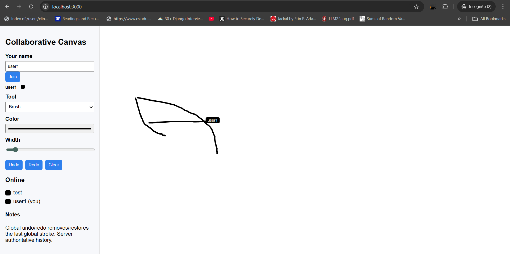

# Collaborative Canvas

A real-time collaborative drawing application built using **Node.js**, **Socket.IO**, and **vanilla JavaScript**.  
Multiple users can draw on the same canvas simultaneously, see each other's cursor movements, and perform global undo/redo operations.

This project was built without any frontend frameworks to demonstrate raw Canvas API usage, WebSocket communication, and clean architecture.

---

## Features

### Drawing Tools
- Brush tool  
- Eraser tool  
- Adjustable stroke width  
- Color picker  

### Real-Time Collaboration
- Live stroke synchronization between users  
- Smooth drawing via point batching  
- Real-time cursor positions for all users  
- Unique color assigned to each user  

### Canvas Actions
- Global Undo  
- Global Redo  
- Clear Canvas  

### User Management
- Display list of connected users  
- Each user has a name and color  
- User cursor labels  

---

## Demo

Run locally (see steps below).  

## Screenshots


## How to Run the Project

Follow these steps to start the project on your machine.

### 1. Download or Clone the Repository

```bash
git clone https://github.com/your-username/collaborative-canvas.git
cd collaborative-canvas

npm install

npm install express socket.io uuid

npm start

```


